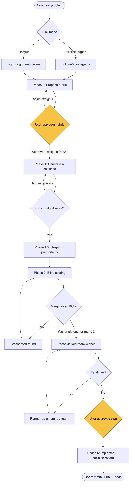
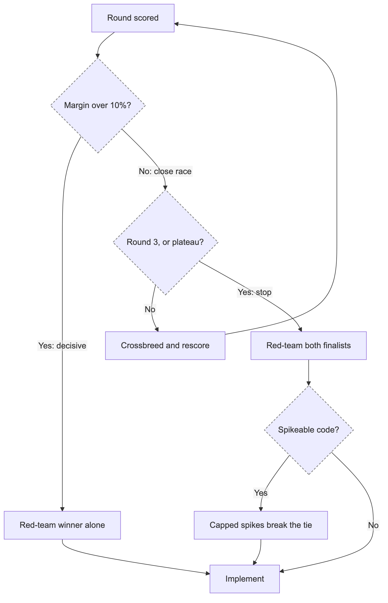

# Solution Tournament

A Claude Code skill that forces multiple genuinely different solutions to compete before any code gets written. Rubric first, blind scoring, adversarial pressure on every candidate, and a hard rule that symptom-patching scores zero.

The goal is a production-grade solution, not the first plausible one.

## The problem this solves

LLM coding assistants have a well-known failure mode: they commit to the first plausible approach. When that approach hits friction, they patch around it. Special cases accumulate. Errors get suppressed. A "temporary" flag ships to production.

Humans do this too. But an assistant does it faster, with more confidence, and without the nagging feeling that something is off.

This skill breaks that pattern structurally. It makes the assistant generate several solutions that differ on named architectural axes, subject each one to an adversarial skeptic, score them blind against a rubric that was locked before generation, and red-team the winner before implementation. Bandaid fixes are not just discouraged. They are disqualified by rule.

## The pipeline at a glance

<picture>
  <source media="(prefers-color-scheme: dark)" srcset="diagrams/pipeline-dark.png">
  
</picture>

**Reading the diagram: amber nodes are decisions the user makes. Dashed-outline nodes are mechanical gates decided by rules and scores, with no judgment involved. Everything else is the LLM's work.**

The user touches the tournament at exactly two points: approving the rubric weights before generation (Phase 0), and approving the implementation plan before code is written (plan mode, for multi-file changes). Everything between those two points runs without the user, except that close calls and scorer disagreements are surfaced rather than silently resolved.

Node detail that used to live in the diagram, now here where it fits:

- **Pick mode** (LLM): lightweight is the default; full mode requires an explicit trigger (architecture, failed prior fix, high blast radius, or user request). When genuinely unsure, the LLM asks in one sentence.
- **Phase 0** (LLM proposes, user disposes): dimensions, weights, the disqualification rule, and a read of past decision records. Weights encode the user's values, which is why this is a user gate.
- **Structurally diverse?** (mechanical): each candidate must differ on a named structural axis. Paraphrases of one idea fail the check and force regeneration.
- **Margin over 10%?** (mechanical): the weighted score margin alone decides whether another round runs. Details in the rounds section below.
- **Phase 4** covers 10x scale, the 6-months test, the killer-assumption question, and the bandaid check.
- **Phase 5** requires tests for the motivating failure and writes the decision record to `docs/decisions/`.

Two loops can fire along the way: a **crossbreed loop** back into scoring when no candidate wins decisively, and a **runner-up loop** in red-team if the winner has a fatal flaw. Both are bounded.

## How it works

The pipeline is generate, score, crossbreed, implement. Six phases:

### Phase 0: Lock the rubric before generating

Scoring criteria are defined and weighted before any solution exists. This ordering is mandatory. Criteria chosen after seeing solutions become rationalizations for a favorite.

Default dimensions (adjustable per problem):

| Dimension | Default weight |
|---|---|
| Root-cause resolution (fixes the disease, not the symptom) | 30% |
| Robustness / production-readiness (edge cases, 10x scale, the 6-months-later test) | 25% |
| Maintainability / simplicity | 20% |
| Performance / cost | 15% |
| Implementation risk (blast radius, reversibility) | 10% |

The rubric goes to the user for approval before generation. Weights encode the user's values, not the assistant's. After approval, weights freeze for the round.

Phase 0 also defines a **disqualification rule**: any solution that treats a symptom while leaving the root cause intact scores 0 overall, regardless of how well it does on every other dimension. The symptom is named explicitly so the rule is checkable, not vibes, and the root-cause claim must cite observable evidence (a reproduction, trace, or measurement). If the diagnosis is a hypothesis rather than verified, it is labeled HYPOTHESIS at the rubric checkpoint, so the user knows they are approving a diagnosis and not just weights.

Finally, it checks `docs/decisions/` for records of past tournaments in the same area. Records are treated as dated claims: a past rejection is carried forward only after verifying its original blocker still exists, so a stale record cannot silently block a now-viable approach.

### Phase 1: Divergent generation

The skill generates n solutions (3 in lightweight mode, 5 in full mode) with structural diversity enforced:

- Each solution must differ from every other on at least one **named structural axis**: architecture, data model, dependency, algorithm class, or where the logic lives. Five paraphrases of one idea is a failed round and triggers regeneration.
- Slot #1 is reserved for the obvious approach, named explicitly so it cannot masquerade as several entries.
- At least one solution must be unconventional: something the assistant would normally self-censor as too weird or too ambitious.

Each candidate gets a mechanism description (150 words max), its assumptions, and what breaks it. Descriptions are equal length across candidates, because verbosity biases scorers.

### Phase 1.5: Skeptic pass

Before scoring, a single adversarial skeptic attacks all candidates in one batched pass: mechanism, assumptions, hidden costs. The skeptic can also issue a **filler verdict**: a candidate that is structurally distinct but has no plausible path to winning any dimension is dropped before scoring rather than revised, because scoring strawmen wastes tokens and a weak field flatters the winner. If dropping filler leaves a single candidate, that is evidence the problem has one reasonable answer, and it goes straight to red-team; two survivors still race. Each surviving candidate then gets one revision pass with a hard guard: the revision may strengthen the solution but may not change its structural axis. This prevents the skeptic from sanding every candidate into the same safe shape.

Each revised solution ships with a **premortem** (80 words max): "It is 12 months from now and this solution failed in production. What happened?" Premortems travel with the candidates into scoring.

### Phase 2: Blind adversarial scoring

Self-scoring by the generator is unreliable. Scores cluster at 7 to 8 and drift toward the author's favorite. The skill counters this:

- A scoring subagent receives only a **context pack** (problem statement, locked rubric, disqualification rule, concrete constraints) plus the solutions under neutral shuffled labels (A, B, C). All generation reasoning is excluded.
- For high-stakes rounds, two independent scorers run and results aggregate by median rank. Sharp disagreement between judges is surfaced to the user as signal, not smoothed over.
- The disqualification rule applies first, before any scoring.
- Scoring uses **forced ranking within each dimension** (rank 1 to n, no ties) alongside scores, because comparative judgment is more reliable than absolute scores.
- **Every score must cite one concrete fact from the context pack**: a file excerpt, an interface, a scale number. A score that cannot name its fact is flagged as opinion in the matrix. This is the countermeasure to scorers sharing the generator's priors: facts are checkable, consensus is not.
- The full weighted matrix is always shown. Never just the winner.

### Phase 3: Decision gate

If the top solution wins by a clear margin (over 10% weighted) and survives the red-team, it advances to implementation.

Otherwise, a **crossbreed round**: the top 2 or 3 candidates produce new offspring, each explicitly naming which traits it inherits from which parents ("B's storage model plus D's retry semantics"). One offspring gets a **mutation**: a single assumption perturbed. The same rubric scores the new field.

Maximum 3 rounds. If the top score plateaus (under 5% improvement round over round), the leader wins. Further rounds are churn.

The 10% margin, 5% plateau, and 3-round cap are uncalibrated defaults, and the skill says so: near-threshold results are surfaced to the user with the matrix rather than silently decided by the arithmetic.

### Phase 4: Red-team before implementation

Before production code, the winner faces a fresh adversarial pass:

- What happens at 10x data, traffic, or users?
- What happens in 6 months when the original context is forgotten?
- Which single assumption, if false, kills it? How would we detect that early?
- Is any part of this secretly a bandaid wearing a suit? Special cases, silenced warnings, magic constants, "temporary" flags.

If the top two finished within 10% of each other, both get red-teamed in parallel, so the runner-up cannot inherit the crown unexamined.

**Empirical spike gate:** for close races on spikeable problems, the skill builds a minimal throwaway prototype of each finalist, the smallest artifact that tests the killer assumption from its premortem, and lets the results break the tie. Evidence outranks judgment. Spikes are time-capped, and a spike that blows its cap is itself a signal the risk is real. Spike code never gets promoted to production.

### Phase 5: Implement to production standard

Production standard means: tests covering the failure mode that motivated the tournament, error handling for the assumptions identified in Phase 1, and no TODOs standing in for decisions.

The tournament ends by writing a **decision record** to `docs/decisions/`: problem, rubric and weights, final score matrix, winner and why, runner-up, red-team findings and mitigations. Future tournaments read these records in Phase 0. This is how the process compounds instead of resetting every session.

## Who decides what

Every decision in the tournament has exactly one owner: the user, the LLM, or a mechanical rule. Nothing is jointly owned, so nothing falls through the gap.

| Decision | Owner | How |
|---|---|---|
| Mode (lightweight vs. full) | LLM | Lightweight by default; full only on an explicit trigger. Asks the user when genuinely unsure. The user can always force full mode by requesting it. |
| Rubric dimensions and weights | **User** | LLM proposes, user approves or adjusts before generation. The single highest-leverage user decision: weights encode values. Skippable only if the user pre-authorized autonomous runs. |
| Disqualification rule (what counts as the symptom) | LLM | Proposed alongside the rubric, so the user sees it at the same gate. |
| Candidates, critiques, premortems, scores | LLM | Subagents in full mode, separated passes in lightweight mode. |
| Number of rounds | **Nobody** | Mechanical: score margin over 10% ends it, plateau under 5% ends it, round 3 ends it. No judgment involved. |
| Spike gate (build tiebreak prototypes?) | LLM | Opens automatically when the race is close and the problem is spikeable code. Effort is capped. |
| Close calls and scorer disagreements | **User** | Sharp inter-judge disagreement or a near-tie with a real tradeoff is surfaced with the matrix, not resolved silently. |
| Implementation plan (multi-file changes) | **User** | Plan mode approval before edits. |

## One round or many? One agent or many?

Two independent dials control how heavy a tournament gets. **Stakes** set the mode (how many candidates, whether subagents run). **Score margin** sets the round count (whether crossbreeding happens). They are decided at different times: the LLM chooses the mode up front, and the round count emerges from the scores with no one choosing at all.

### Dial 1: Stakes pick the mode (decided before the tournament starts)

| | Lightweight (default) | Full tournament |
|---|---|---|
| When | Contained bug, single-file change, reversible decision | Architecture, cross-cutting change, high blast radius, a previous fix failed, data-integrity stakes |
| Candidates | 3 | 5 |
| Skeptic pass | Inline: a clearly separated adversarial pass in the main thread | A fresh subagent attacks all candidates in one batched call |
| Scoring | Inline: steelman the case against each candidate, then score | A blind subagent sees only anonymized candidates + rubric |
| Scorers | 1 (self, in a separated pass) | 1 subagent; **2 independent subagents** for high-stakes rounds, aggregated by median rank |
| Red-team | Inline | Fresh subagent |
| Spike gate | Not used | Available for close races on spikeable problems |
| Rounds possible | Usually 1 | Up to 3 |

Lightweight is the default. Full mode requires an explicit trigger, so a typo fix never gets ceremony and a schema migration never skips rigor. The mode can also drop mid-flight: if Phase 0 or 1 reveals the problem deflated, the tournament downgrades to lightweight or exits entirely, because ceremony that outlives its justification is pure overhead. Every principle (locked rubric, structural diversity, premortems, disqualification rule, full matrix) applies in both modes. What changes is who does the work: in lightweight mode the main thread wears different hats in separated passes; in full mode, independent subagents wear them, which buys real blindness at the cost of tokens.

### Dial 2: Score margin picks the round count (decided by the results)

One round is the normal case. Extra rounds are not "more thorough", they are a tiebreaker, and they only run when the scores say the race is genuinely close:

- **Clear winner (weighted margin > 10%)**: one round. Straight to red-team.
- **Close race (margin <= 10%)**: crossbreed round. The top 2 or 3 candidates produce offspring that explicitly name which traits they inherit from which parents, plus one mutation (a single perturbed assumption). The same frozen rubric scores the new field.
- **Plateau (top score improves < 5% round over round)**: stop, take the leader. Further rounds are churn.
- **Hard cap**: 3 rounds, no matter what.

<picture>
  <source media="(prefers-color-scheme: dark)" srcset="diagrams/rounds-dark.png">
  
</picture>

**Every gate in this diagram is mechanical (dashed outline): margins, round caps, and plateau thresholds decide, not judgment.** The user does not appear here at all, with one exception covered in the table above: when the stopped race is a genuine tradeoff, the finalists go to the user with the matrix and the red-team findings, as in the example below.

A close race also changes the endgame. When the top two finish within 10%, both are red-teamed in parallel, so the runner-up cannot inherit the crown unexamined if the winner falls. And in full mode, if the problem is code rather than strategy, the **spike gate** opens: a minimal time-capped throwaway prototype of each finalist tests the killer assumption from its premortem, and the measurements break the tie instead of judgment.

### Where the agents are (full mode)

Subagent boundaries exist for one reason: information hiding. The scorer must not see the generation reasoning, or it inherits the generator's favorite.

- **1 generator** (main thread): runs Phase 0 and Phase 1, holds full context.
- **1 skeptic subagent**: attacks all candidates in one batched call. One skeptic, not one per candidate, because the skeptic ranks nothing, so its independence buys little.
- **1 scoring subagent** (2 for high-stakes rounds): receives only the context pack and anonymized candidates. This is the boundary that matters most. Two scorers aggregate by median rank, and sharp disagreement between them is surfaced to the user as signal.
- **1 red-team subagent** (2 in parallel when the race was close).

Deliberation stays inside the subagents. Only summaries, the matrix, and decisions return to the main thread.

## When it triggers

Explicitly, when you say things like:

- "tournament" or "run the tournament"
- "generate 5 solutions and score them"
- "compare approaches" or "which option should we pick"

Proactively, when:

- A previous fix attempt failed
- You are stuck
- The task smells like it invites a bandaid: patching symptoms, special-casing inputs, suppressing errors

## Example

Say you report: "The dashboard query times out for accounts with more than 10k records. Previous fix (raising the timeout) didn't hold."

A typical assistant might raise the timeout again, or add a cache in front of the slow query. The tournament instead:

1. **Phase 0** names the symptom (slow query masked by timeout tuning) and locks the rubric. Any solution that adjusts timeouts without touching query cost scores zero. It also finds last quarter's decision record rejecting a read-replica approach and carries that constraint forward.
2. **Phase 1** generates five structurally distinct candidates: (A) add a composite index and rewrite the N+1 access pattern, (B) precompute aggregates into a summary table on write, (C) paginate the query and stream results to the client, (D) move the aggregation into a materialized view refreshed on a schedule, (E) the unconventional one: change the data model so the dashboard reads a purpose-built projection instead of the transactional tables.
3. **Phase 1.5** has the skeptic attack all five. B's premortem: "Write amplification made inserts slow; the summary table drifted from source during a partial outage and no one noticed for a week." That premortem travels into scoring.
4. **Phase 2** scores them blind. A wins on implementation risk, E wins on root cause and 10x robustness. They finish within 10% of each other.
5. **Phase 4** red-teams both. The spike gate builds a 30-minute prototype of each: A's index cuts the query from 9s to 400ms on production-shaped data; E's projection gets it to 80ms but the spike surfaces a migration cost the scorers underweighted. The user sees the matrix, the spike numbers, and the tradeoff, and picks A now with E recorded as the path if the account growth curve holds.
6. **Phase 5** implements A with a regression test pinned to the 10k-record failure case, and writes the decision record so the next tournament in this area starts from evidence instead of zero.

The output always includes the rubric, the score matrix per round, the decision trail, and red-team findings. You see why the winner won and what almost beat it.

## Why this beats just asking for options

You can always prompt "give me 3 options and pick the best." Here is what that gets you, and what the tournament does differently:

**Ad-hoc options converge; tournament candidates are forced apart.** Unstructured brainstorming produces three paraphrases of the same idea. The named-structural-axis requirement makes convergence a detectable failure that triggers regeneration.

**Ad-hoc scoring is motivated reasoning; tournament scoring is blind.** When the same context that generated the solutions also scores them, the favorite wins. Here the scorer sees anonymized candidates, a locked rubric, and nothing else.

**Ad-hoc criteria are post-hoc; the tournament rubric is locked first.** Criteria invented after seeing options get bent to justify a preference. Freezing weights before generation, with user approval, removes that degree of freedom.

**Ad-hoc picks skip the failure analysis; every tournament candidate carries a premortem.** Scorers judge each solution alongside a concrete story of how it dies in production.

**Ad-hoc processes reset; tournaments compound.** Decision records in `docs/decisions/` mean the tenth tournament in a codebase starts smarter than the first. Rejected approaches stay rejected. Constraints persist across sessions.

**And the structural difference from other review-style skills:** most quality skills inspect work after it exists (code review, verification loops, red-teaming a finished plan). The tournament applies pressure before and during solution selection, when changing course is cheap. It is anti-bandaid by construction, not by inspection: symptom patches are disqualified at the rubric level, and the "is this a bandaid wearing a suit" check runs before a single production line is written.

## Honest pros and cons

The tournament is a bet that structure beats improvisation for consequential decisions. Like any bet, it has a price. Decide with both columns visible.

### Pros

- **Structural diversity is enforced, not hoped for.** The named-axis requirement plus a reserved slot for the obvious approach means you actually see the solution space, including the option you would have picked anyway, ranked against real alternatives.
- **The scoring bias countermeasures are real.** Locked-first rubrics, anonymized candidates, excluded generation reasoning, and forced ranking each remove a specific, documented failure mode of self-evaluation. None is perfect (see cons), but each closes a door.
- **Bandaids are disqualified at the rubric level.** A symptom patch scores zero before scoring even starts. This is prevention by construction, not detection by review.
- **Close calls get evidence, not confidence.** The spike gate replaces "I believe A is faster" with a measured number from a throwaway prototype.
- **It compounds.** Decision records mean the tenth tournament in a codebase inherits the constraints and rejected approaches of the first nine. Ad-hoc deliberation starts from zero every session.
- **Cost is bounded and calibrated.** Lightweight mode exists precisely so the machinery scales down; round caps and plateau detection stop churn; deliberation stays in subagents.

### Cons

- **It costs real tokens and real time.** A full tournament spawns a skeptic, one or two scorers, and one or two red-teamers, across up to three rounds. That is several times the cost of just implementing the obvious fix. When the obvious fix is actually right (often), the tournament is pure overhead that ends by selecting it anyway. Mitigation in the skill: a mid-flight downgrade rule. If Phase 0 or 1 reveals the problem deflated, the tournament drops to lightweight or exits entirely rather than finishing the ceremony.
- **The blindness is imperfect.** The scorer is a fresh context, but it is the same model family with the same priors. Anonymization removes the generator's stated reasoning, not shared blind spots. Two "independent" scorers can agree because they share training, not because they are right. Mitigation in the skill: every score must cite one concrete fact from the context pack; a score that cannot name its fact is flagged as opinion in the matrix. Grounding in checkable facts is what separates evidence from consensus. And optionally, a scorer slot can now run cross-model (`references/full-mode.md`, Cross-model scoring): CROSS-VENDOR via a transport script to a non-Anthropic model when an API key is available (real lineage independence; the key stays in the environment, never in the skill), or CROSS-TIER via a different Claude model in-session (cheaper, partial). Cross-vendor disagreement is the strongest signal the skill can produce short of a spike; cross-vendor agreement is still weak corroboration, since both models read the same single-authored pack.
- **The thresholds are invented, not measured.** The 10% decision margin, the 5% plateau, the 3-round cap, and the weight defaults are sensible-sounding numbers without empirical calibration behind them. The skill logs token spend per tournament so they can be tuned from data, but until that data accumulates, they are judgment dressed as arithmetic. Mitigation in the skill: the thresholds are labeled uncalibrated, and near-misses are surfaced to the user with the matrix instead of being silently decided by the arithmetic. The calibration path is now formalized: `docs/calibration-protocol.md` carries a run log (two entries so far) plus the decision gates the data feeds — threshold tuning, the micro-tier go/no-go, and the mode boundary.
- **Forced diversity can produce filler.** When a problem genuinely has one reasonable answer, the requirement for n structurally distinct candidates yields strawmen with premortems. The scoring usually disposes of them cheaply, but generating them still costs tokens, and a weak field can flatter the winner. Mitigation in the skill, hardened by a live run: the skeptic can issue a filler verdict that drops a non-credible candidate before scoring, a single surviving candidate skips scoring and goes straight to red-team (two survivors still race; the first live run caught an off-by-one here), and the mandatory unconventional slot now requires a credible long shot that could plausibly win at least one dimension, so the slot does not exist just to be culled.
- **Premortems are speculation.** An imagined failure story is a bias corrector, not a test. Only the spike gate produces evidence, and it applies to a narrow class of problems (spikeable code, close races, full mode).
- **The disqualification rule depends on naming the symptom correctly.** If the root cause is misdiagnosed in Phase 0, the rule disqualifies the wrong things with full confidence. Rubric approval puts a human check on this, but a user who rubber-stamps inherits the misdiagnosis. Mitigation in the skill: the root-cause claim must cite observable evidence, an unverified diagnosis is labeled HYPOTHESIS at the rubric checkpoint so the user knows what they are approving, and — where an execution tool exists — a VERIFIED removal requires the diagnosis demonstrated in session (the cited command or failing test re-run, verbatim output in the record) before it stands; a citation-only diagnosis caps at HYPOTHESIS, which caps scores instead of removing candidates, so a misdiagnosis fails loudly at Phase 0 instead of propagating with full confidence.
- **Decision records rot like all documentation.** The compounding benefit assumes future tournaments read them and that they stay true. A stale record that says "approach E was rejected" can block an approach whose blockers have since disappeared. Mitigation in the skill: records are treated as dated claims, and a rejection is only carried forward after verifying its original blocker still exists — each rejection now records its blocker-check command ("this rejection holds while `<command>` still shows X"), so carrying it forward means re-running a command, not judging staleness, and a rejection without a runnable check is a dated claim, never a standing block.
- **Process can crowd out thinking.** A tournament run mechanically produces the artifacts (matrix, premortems, record) without the judgment they are meant to carry. The format guarantees the boxes are filled, not that filling them was honest. Mitigation in the skill: a final honesty check requires mechanically produced artifacts to be redone or labeled weak in the output, and `scripts/validate_run.py` now mechanically checks the output's shape and arithmetic (recomputed totals, checklist denominators, sweep name list, mandatory lines) with its verdict pasted into the record. Partial still: the validator certifies shape, not honesty — a check on honesty remains self-administered.

### The net

Use it when being wrong is expensive: architecture, migrations, anything with a failed fix already behind it, anything hard to reverse. Skip it when being wrong costs a revert: the lightweight mode exists for the middle ground, and for genuinely trivial changes even that is ceremony. The skill's own calibration section says the same thing, which is a point in its favor: it does not claim to be free.

One more data point, now with a sharper edge: across three consecutive recorded runs on one production codebase, the red-team phase overturned the scored winner every time (`references/lessons.md`, L-T1). In the most recent, three scorers gave the eventual loser a 6.5 with zero spread while its central premise was false on both measured artifacts; one grep disproved it, and the candidate the panel had ranked last won. The generate-and-score half has not yet produced a decision that survived adversarial review unchanged. Two consequences are now written into the skill: a pre-Phase-4 ranking is treated as a hypothesis, and Phase 4 is never skipped or thinned to save cost. Earlier history pointed the same direction: the skill has been run in anger twice before that. The first run (diagram sync, `docs/decisions/0001-diagram-sync.md`) surfaced two bugs in the skill itself, both since fixed: the filler early-exit threshold was off by one, and the unconventional slot invited candidates that existed only to be culled. The second (`docs/decisions/0004-subagent-report-delivery.md`, an attended lightweight run on a real infrastructure failure) is the stronger evidence: the disqualification cap demoted the author's pre-registered favorite to third, the mandatory field-ceiling question produced the eventual winner — an approach absent from the generated field — and the near-miss machinery caught a margin of exactly 1.00 against the >1.0 gate and routed the call to the user instead of the arithmetic. The winning fix's acceptance test then recovered a lost nine-finding report that a hand audit had missed entirely. A process that catches its own defects on first contact is working as designed; a process that had none to catch would be more suspicious.

## Cost discipline

Deliberation stays in subagents. Only summaries, the score matrix, and decisions return to the main thread, so the tournament's transcript does not crowd out the implementation's context. Decision records are one page max. Token spend is logged per tournament, so calibration thresholds move based on real usage data, not intuition.

## Verification tooling

Three stdlib-only scripts keep the skill honest, added after a structural review found that most of the skill's self-checks assumed "a reader who recomputes" who rarely exists:

- **`scripts/lint_skill.py`** — pre-commit consistency gate for the skill files themselves: cross-file pointers, checklist denominators (48 full / 15 lightweight), the 18-call sum, size claims against real `wc` counts, secret hygiene. Its regression tests are seeded from real defects found in live audits.
- **`scripts/validate_run.py`** — validates a tournament's output transcript: recomputes every weighted total from printed cells, checks the near-miss sweep's name list against the mode's enumeration, and verifies every mandatory line for the run shape. Its verdict is pasted into the record, and its strikes count as degraded-execution strikes. It certifies shape and arithmetic, never truth — the single-author caveat survives all tooling.
- **`scripts/cross_model_score.py`** — optional cross-vendor scorer transport (see "Configuring cross-model scoring" below).

`templates/run-skeleton.md` defines the machine-readable block formats the validator parses; both modes fill it in flow.

## The skill maintains itself

Every run now ends by appending a per-mechanism scorecard to `references/lessons.md`, including the mechanisms that produced nothing, because a mechanism that is only ever praised is not being evaluated. Lessons have a lifecycle: one observation makes a CANDIDATE; two confirmations, or one airtight causal chain, promote the rule into the skill with a date stamp and a pointer to where it landed; counter-evidence demotes it with the reason recorded, never a silent deletion. Guardrails keep the loop honest: a promotion may tighten but never weaken a binding rule, an evidence bar, or an adversarial phase; every rule cites the run that earned it; and open questions (starting with "how often does the scoring phase, as opposed to the red team, actually change the outcome?") stay listed as UNANSWERED until run data answers them. The ledger also feeds the sibling generation skill, [novelty-hunt](https://github.com/rwshiraishi/novelty-hunt): after a full hunt has scored a field, this skill now enters at its adversarial phases instead of scoring the same field twice.

## Installation

This skill is **ten files plus tests**, not one: `SKILL.md`, two mode references (`references/lightweight-mode.md`, `references/full-mode.md`), four templates (three spawn prompts plus the run skeleton), and three scripts (the cross-model transport, a skill-consistency linter, and a run-output validator). `SKILL.md` references the mode files throughout — lightweight mode reads its reference before Phase 0 and full mode reads its own — so copying only `SKILL.md` gives you a skill whose rules point at files that do not exist.

### Configuring cross-model scoring (optional)

Full mode can send one scorer slot to a non-Anthropic model (`references/full-mode.md`, "Cross-model scoring"). Nothing is required for the skill to work — without this configuration it falls through to a Claude scorer and says so in the matrix. To enable the CROSS-VENDOR tier:

1. **API key.** Export `OPENAI_API_KEY` in the environment the agent runs in (e.g. your `~/.zshrc`). The key is read from the environment at call time only — it is never written into the skill files, the scorer packet, the matrix, or the decision record, and never passed on a command line.

2. **Model name.** Export `ST_CROSS_MODEL` with the OpenAI model you want on scoring duty (or pass `--model` per call). The script deliberately ships with **no default model** — a baked-in name would rot, and a wrong guess would fail mid-tournament.

   ```bash
   export OPENAI_API_KEY="<your key>"     # or wherever your shell already sets it
   export ST_CROSS_MODEL="<model name>"   # e.g. the current GPT flagship or mini tier
   ```

3. **Verify the setup** (no tokens spent — errors are free):

   ```bash
   echo "ping" > /tmp/st-pkt.txt
   python3 scripts/cross_model_score.py /tmp/st-pkt.txt --model "$ST_CROSS_MODEL"
   ```

   A completion printed to stdout means you are configured. Exit codes if not: `2` key missing, `3` network/HTTP error (a 404 body naming the model means the key works but the model name is wrong; a 401 means the key is bad), `4` unexpected response shape, `5` usage error (no model named, unreadable packet, bad flag). The skill's fallback rule branches on exactly these codes: any nonzero gets one retry, then the slot falls through to a Claude scorer with the downgrade printed.

4. **Different vendor?** The script is a ~120-line stdlib-only transport hardcoded to OpenAI's chat completions endpoint. Pointing it at another OpenAI-compatible endpoint means editing `API_URL` in `scripts/cross_model_score.py`; a non-compatible vendor needs its own transport with the same exit-code contract (0/2/3/4/5) — that contract, not the vendor, is what the skill depends on.

The CROSS-TIER fallback (a different Claude model for the scorer subagent, in-session) needs no configuration at all — it uses the host's own model override and is labeled in the matrix as same-lineage, partial independence.

```
solution-tournament/
├── SKILL.md                  # required: the shared spine both modes execute
├── references/
│   ├── lightweight-mode.md   # lightweight adaptations, 15-box inventory, budgets
│   └── full-mode.md          # crossbreed rules, spike gate, call ceiling, ledgers, worked example
├── scripts/
│   ├── cross_model_score.py  # optional: CROSS-VENDOR scorer transport (stdlib-only)
│   ├── lint_skill.py         # consistency gate for the skill files themselves (pre-commit)
│   ├── validate_run.py       # validates a run's output: shape + arithmetic, never truth
│   └── tests/                # unittest suites for all three scripts
└── templates/
    ├── scorer.md             # spawn prompts for the full-mode subagents
    ├── skeptic.md
    ├── red-team.md
    └── run-skeleton.md       # fill-in output skeleton both modes use; validate_run parses it
```

### Claude Code

Clone the whole directory into one of two locations:

```bash
# Personal: available in every project
git clone https://github.com/rwshiraishi/solution-tournament.git \
  ~/.claude/skills/solution-tournament

# Project: committed to the repo, shared with everyone who clones it
git clone https://github.com/rwshiraishi/solution-tournament.git \
  .claude/skills/solution-tournament
```

Claude Code watches these directories and picks up the skill **within the current session**, no restart needed. The one exception: if you created the top-level `skills/` directory for the first time, restart once. If the same skill name exists at several levels, enterprise beats personal beats project.

Invoke it explicitly with `/solution-tournament`, or just describe a problem and let the trigger conditions in the frontmatter fire. ([Claude Code skills docs](https://code.claude.com/docs/en/skills))

**Verify the install:**

```bash
ls ~/.claude/skills/solution-tournament/{SKILL.md,references/lightweight-mode.md,references/full-mode.md,scripts/cross_model_score.py,scripts/validate_run.py,templates/}
```

### Claude Code plugin (for teams)

To distribute it to a team as a managed, updatable bundle, add a `.claude-plugin/plugin.json` and publish the repo as a marketplace:

```bash
/plugin marketplace add rwshiraishi/solution-tournament
/plugin install solution-tournament@solution-tournament
```

Plugin skills are namespaced (`/plugin-name:solution-tournament`), so they never collide with a personal or project copy. Validate a manifest before shipping with `claude plugin validate . --strict`. ([Plugins reference](https://code.claude.com/docs/en/plugins-reference))

### claude.ai, Claude Desktop, Cowork, and cloud sessions

These **do not read `~/.claude/skills/` on your machine.** Cowork and cloud sessions load the skills enabled for your claude.ai account, synced at session start. Manage them under **Customize** in the Desktop sidebar or in claude.ai skills settings. Cloud sessions additionally load project skills committed to the cloned repo's `.claude/skills/`.

One compatibility note that bites here: claude.ai uploads and the Skills API accept only `name`, `description`, `license`, `compatibility`, `metadata`, and `allowed-tools` in frontmatter. Any Claude Code specific field (`argument-hint`, `disable-model-invocation`, `context: fork`, …) is rejected with an "Unexpected key(s)" error. This skill's frontmatter uses only `name` and `description`, so it uploads unchanged.

### Claude API / Agent SDK

Skills run through the **code execution tool**. Upload the directory via the Skills API (`/v1/skills`) to get a `skill_id`, then reference it in the `container` parameter, up to 8 skills per request:

```python
container={"skills": [{"type": "custom", "skill_id": "skill_...", "version": "latest"}]}
betas=["skills-2025-10-02", "files-api-2025-04-14"]
```

Pin a specific `version` for stability, and keep the skills list identical across requests, since changing it breaks the prompt cache. ([Skills API guide](https://platform.claude.com/docs/en/build-with-claude/skills-guide))

## Using it outside Claude

`SKILL.md` is an [open standard](https://agentskills.io), originally developed by Anthropic, released openly, and now implemented by 40+ agents. **This skill is portable, and the format needs no translation.** What changes is the install path and the invocation syntax.

### OpenAI Codex

Codex implements the same standard, so the same files work as-is (the cross-model script included, since it is invoked with plain `python3`, not a Claude Code feature — only the CROSS-TIER fallback is Claude Code specific):

```bash
# User scope: available everywhere
git clone https://github.com/rwshiraishi/solution-tournament.git \
  ~/.agents/skills/solution-tournament

# Repo scope: Codex scans .agents/skills from cwd up to the repo root
git clone https://github.com/rwshiraishi/solution-tournament.git \
  .agents/skills/solution-tournament
```

Invoke with `/skills`, or type `$solution-tournament`. Implicit invocation from the `description` works too, and can be disabled per-skill via `allow_implicit_invocation: false` in an optional `agents/openai.yaml`. Disable a skill without deleting it in `~/.codex/config.toml`:

```toml
[[skills.config]]
path = "/path/to/solution-tournament/SKILL.md"
enabled = false
```

**Full mode works in Codex**, because Codex supports subagents. Define them as TOML files under `~/.codex/agents/` or `.codex/agents/`. Note that Codex only spawns subagents when explicitly asked, so say so when starting a full-mode run. ([Codex skills](https://developers.openai.com/codex/skills/) · [Codex subagents](https://developers.openai.com/codex/subagents))

### Other agents implementing the standard

Cursor, GitHub Copilot and VS Code, Gemini CLI, OpenCode, Goose, Amp, Roo Code, Kiro, Factory, OpenHands, JetBrains Junie, and others all read `SKILL.md`. Check each client's docs for its skills directory. The [client showcase](https://agentskills.io/clients) links them. The file itself does not change.

### What degrades where, honestly

The tournament's rigor comes from capabilities the host either has or doesn't. Where one is missing, the skill does not silently pretend. It has explicit branches for each case, but you should know which you are getting.

| Host capability | Needed for | Without it |
|---|---|---|
| **Subagent spawning** | Full mode: independent skeptic, blind scorers, red-team, implementation reviewer | Lightweight only. One agent self-scores, self-skeptics, self-red-teams. The output says so on every run. |
| **Shell / command execution** | The evidence floor: pack hashing, re-running a MEASURED fact in session | The no-execution-tool branch fires: prints `hash unavailable`, records zero re-runnable facts, and every decisive gate fails to NO WINNER rather than fabricating a value. |
| **A reachable user** | Rubric checkpoint, verbatim field + objection route, close-pair decisions | Autonomous mode. Most branches end in NO WINNER by design, so the honest headline becomes "compare and report", not "compare and implement". |
| **File writes** | Pack file, decision record in `docs/decisions/` | Record content goes to session output with a note that there is nowhere durable to write it. |

The short version: **any standards-compliant agent can run lightweight mode**; full mode needs subagents; and the evidence floor needs a shell. An agent with none of the three still runs the process, but you are getting a structured comparison rather than a verified decision, and the run will tell you that in its own output.

### Cost before you install

Loading the skill costs tokens before a single candidate exists. Lightweight loads `SKILL.md` plus `references/lightweight-mode.md` and the run skeleton (~20–29k tokens); full mode loads `SKILL.md` plus `references/full-mode.md` and the skeleton (~27–39k), with the spawn templates added at spawn time. The scripts are invoked, never loaded. The skill prices this itself and includes a skip floor that tells you when *not* to run it: one or two files, under ~100 changed lines, an existing test, no failed prior attempt. Read that section before adopting it broadly.

## Related skills

Works well alongside:

- **council**: four-voice structured disagreement for directional strategy calls. Use the tournament when candidates are concrete implementations to score; use council when the decision is a judgment call.
- **architecture-decision-records**: the Phase 5 decision record follows ADR conventions.
- **tech-stack-evaluator**: when the "solutions" are technology choices (framework, database, cloud) rather than implementation approaches.
- **novelty-hunt**: the field-ceiling counterpart. The tournament's one structural blind spot is that it can only rank candidates somebody generated; novelty-hunt searches the solution space for genuinely original ones and scores them for novelty-and-effectiveness. Run it before Phase 1 when the obvious approaches are exhausted or generation keeps producing paraphrases, then feed its survivors into the tournament: novelty-hunt scores originality, the tournament scores production fitness.
- **verification-loop**: runs after Phase 5 to prove the winner actually works before marking it done.

## License

MIT
