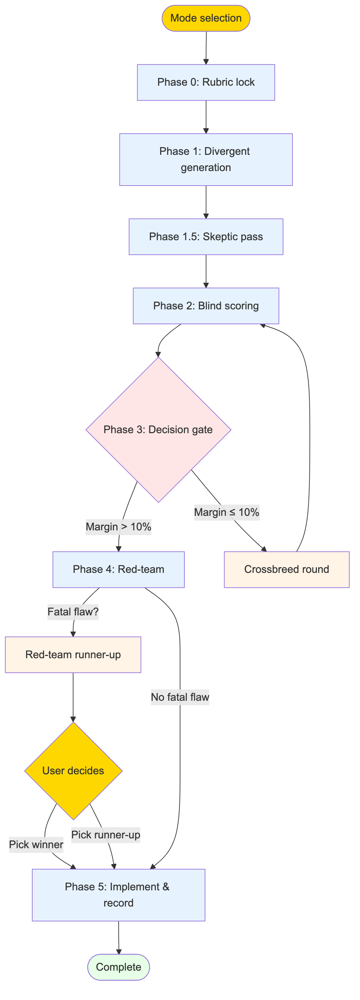

# Solution Tournament

**A Claude Code skill that forces multiple genuinely different solutions to compete before any code gets written.** Rubric first, blind scoring, adversarial pressure on every candidate, and a hard rule that symptom-patching scores zero. The goal is a production-grade solution, not the first plausible one.

[](LICENSE)
[](docs/calibration-protocol.md)
[](references/lessons.md)
[](#requirements)
[](https://neonpeach.co)

<picture>
  <source media="(prefers-color-scheme: dark)" srcset="diagrams/lifecycle-dark.png">
  
</picture>

**Contents:** [Why](#why-this-exists) · [How it works](#how-it-works) · [Field record](#field-record) · [Quick start](#quick-start) · [Install](#install) · [Using it](#using-it) · [Layout](#repository-layout) · [Self-maintenance](#self-maintenance) · [Design notes](#design-notes) · [Contributing](#contributing) · [Maintainer](#maintainer)

## Why this exists

LLM coding assistants have a well-known failure mode: they commit to the first plausible approach. When that approach hits friction, they patch around it. Special cases accumulate. Errors get suppressed. A "temporary" flag ships to production.

Humans do this too. But an assistant does it faster, with more confidence, and without the nagging feeling that something is off.

This skill breaks that pattern structurally. It forces the assistant to generate several solutions that differ on named architectural axes, subject each one to an adversarial skeptic, score them blind against a rubric that was locked before generation, and red-team the winner before implementation. Bandaid fixes are not just discouraged. They are disqualified by rule.

## How it works

The tournament runs through six phases. Lightweight mode (3 candidates, one round, inline scoring) is the default. Full mode (5 candidates, up to 3 rounds, independent subagents) activates on explicit triggers: architecture changes, high blast radius, failed prior fixes, or user request.

### Phase 0: Lock the rubric before generating

Scoring criteria are defined and weighted before any solution exists. This ordering is mandatory. Criteria chosen after seeing solutions become rationalizations for a favorite.

Default dimensions (adjustable per problem):

| Dimension | Weight |
|---|---|
| Root-cause resolution (fixes the disease, not the symptom) | 30% |
| Robustness and production-readiness (edge cases, 10x scale, 6-month test) | 25% |
| Maintainability and simplicity | 20% |
| Performance and cost | 15% |
| Implementation risk (blast radius, reversibility) | 10% |

The user approves the rubric and weights before generation. Weights encode values, not the assistant's favorite. Phase 0 also checks prior decision records in `docs/decisions/` so past rejections do not silently block now-viable approaches. Disqualification is defined here: "any solution that [leaves this root cause intact] scores zero overall". The disqualification rule is checkable, not vibes.

### Phase 1: Divergent generation

The skill generates n solutions (3 in lightweight, 5 in full) that differ on named structural axes: architecture, data model, dependency, algorithm class, or where the logic lives.

Slot 1 is the obvious approach, named explicitly. At least one credible long shot must plausibly win a dimension. All mechanism descriptions are equal length (150 words max each) because verbosity biases scorers.

### Phase 1.5: Skeptic pass

Before scoring, an adversarial skeptic attacks all candidates in one batched pass: mechanism, assumptions, hidden costs, and risk severity. The skeptic issues a filler verdict if a candidate is structurally distinct but has no plausible path to winning any dimension. Filler candidates are dropped before scoring. Survivors get one revision pass that strengthens without changing the structural axis.

Each revised solution ships with a premortem (80 words max): "It is 12 months from now and this solution failed in production. What happened?" Premortems travel into scoring.

### Phase 2: Blind adversarial scoring

<picture>
  <source media="(prefers-color-scheme: dark)" srcset="diagrams/rounds-dark.png">
  
</picture>

A scoring subagent receives only the context pack (problem statement, locked rubric, constraints) plus the solutions under neutral shuffled labels. All generation reasoning is excluded.

Every score must cite one concrete fact from the pack. A score with no fact is flagged as opinion. The full weighted matrix is shown. Never just the winner.

Scoring uses forced ranking (1 to n, no ties) because comparative judgment is more reliable than absolute scores. Ties on scores break by mean rank. In full mode, two independent scorers run and results aggregate by median rank. Sharp disagreement is surfaced to the user as signal, not smoothed.

### Phase 3: Decision gate

<picture>
  <source media="(prefers-color-scheme: dark)" srcset="diagrams/pipeline-dark.png">
  
</picture>

If the top solution wins by over 10% margin, it advances to red-team. Otherwise, the top 2 or 3 candidates breed. Crossbreed offspring explicitly name which traits they inherit from which parents. One offspring gets a mutation: a single assumption perturbed. The same rubric scores the new field.

Maximum 3 rounds. If the top score plateaus (under 5% improvement round over round), the leader wins. Further rounds are churn.

### Phase 4: Red-team before implementation

The winner faces a fresh adversarial pass covering production pressure: what happens at 10x data, traffic, or users. What happens in 6 months when context is forgotten. Which single assumption, if false, kills it. Is any part secretly a bandaid: special cases, silenced warnings, magic constants, "temporary" flags.

If the top two finished within 10% of each other, both get red-teamed in parallel so the runner-up cannot inherit the crown unexamined. Empirical spike gate: for close races on spikeable problems, a minimal throwaway prototype tests the killer assumption from the premortem. Results break the tie. Evidence outranks judgment.

### Phase 5: Implement to production standard

Production standard means tests covering the failure mode that motivated the tournament, error handling for the assumptions identified in Phase 1, and no TODOs standing in for decisions.

The tournament ends by writing a decision record to `docs/decisions/`: problem, rubric and weights, final score matrix, winner and why, runner-up, red-team findings and mitigations. Future tournaments read these records in Phase 0. This is how the process compounds instead of resetting every session.

## Field record

Three live runs through 2026-08-18 (calibration protocol in `docs/calibration-protocol.md`):

| Run # | Date | Mode | Problem | Pre-reg matched? | Safeguard impact | Record |
|---|---|---|---|---|---|---|
| 1 | 2026-08-08 | Full | Diagram sync strategy | — | Filler early-exit prevented over-scoring a weak field | docs/decisions/0001-diagram-sync.md |
| 2 | 2026-08-13 | Lightweight | Subagent report delivery | NO (pre-reg finished 3rd, capped) | DQ cap + field-ceiling question recovered a lost 9-finding report | docs/decisions/0004-subagent-report-delivery.md |
| 3 | 2026-08-18 | Full | DataSculpt density channel | YES | Plateau rule decisive: stopped at 2 rounds, caught arithmetic error in 5/5 scorer rows | (run ledger in references/full-mode.md) |

Key lessons: the red-team **always overturn the scored winner on architecture problems**. Three runs, three Phase 4 finds. Pre-Phase-4 ranking is a hypothesis. Filler verdicts and plateau rule are high-leverage: together they prevent two hours of pointless rounds.

## Quick start

The skill ships in every Claude Code install. Invoke with `/solution-tournament`, `/skills`, or type `tournament`.

```
/solution-tournament
This looks like a decision between multiple concrete approaches to implement.
Mode (lightweight or full)?
```

Answer lightweight (default) or full. Lightweight is fine for single-file fixes, contained bugs, reversible decisions. Full mode requires an explicit trigger: architecture change, high blast radius, a previous fix failed, data-integrity stakes, or user request.

Example lightweight run:

```
/solution-tournament
Mode: lightweight

Problem statement: [paste or describe the choice]
Rubric dimensions (use defaults or adjust)? [approve or reweight]

Phase 1: Generating 3 candidates...
[mechanisms, assumptions, what breaks]

Phase 1.5: Skeptic critique and premortems...
[skeptic findings and revisions]

Phase 2: Blind scoring...
[weighted matrix with full context]

Decision: Candidate B wins by 12% margin. Advancing to red-team.

Phase 4: Red-team findings...
[10x scale, 6-month test, killer assumption, bandaid check]

Phase 5: [Implementation plan approval before edits]
```

## Install

### Requirements

- Claude Code installed (any host: web, CLI, desktop, IDE extensions)
- Python 3.9+ (for lint and test scripts; optional if you do not develop the skill)

### Claude Code (recommended)

**Option A: Symlink (recommended)**

The skill lives at the repo root. Make a symlink in your Claude Code skills directory:

```bash
git clone https://github.com/rwshiraishi/solution-tournament.git ~/dev/solution-tournament
ln -s ~/dev/solution-tournament ~/.claude/skills/solution-tournament
```

Verify the install:

```bash
ls ~/.claude/skills/solution-tournament/SKILL.md
```

Update by pulling the repo:

```bash
cd ~/dev/solution-tournament && git pull
```

Uninstall by removing the symlink:

```bash
rm ~/.claude/skills/solution-tournament
```

**Option B: Copy**

Copy the repo into your skills directory:

```bash
git clone https://github.com/rwshiraishi/solution-tournament.git \
  ~/.claude/skills/solution-tournament
```

Updates require re-cloning. Symlink is recommended for active development.

### Project-scoped skills

Drop the repo or a symlink in `.agents/skills/solution-tournament` at your project root. Claude Code scans that directory first.

### Codex

Codex scans `.codex/agents/skills` from cwd up to the repo root:

```bash
git clone https://github.com/rwshiraishi/solution-tournament.git \
  .agents/skills/solution-tournament
```

Invoke with `/skills` or type `$solution-tournament`. Implicit invocation from the description works too (disable per-skill in `~/.codex/config.toml` via `allow_implicit_invocation: false`).

Full mode works in Codex because Codex supports subagents. Define them as TOML files under `~/.codex/agents/` or `.codex/agents/`. Note that Codex only spawns subagents when explicitly asked, so say so when starting a full-mode run. ([Codex skills](https://developers.openai.com/codex/skills/) · [Codex subagents](https://developers.openai.com/codex/subagents))

### Other agents

Cursor, GitHub Copilot and VS Code, Gemini CLI, OpenCode, Goose, Amp, Roo Code, Kiro, Factory, OpenHands, and JetBrains Junie all read `SKILL.md`. Check each client's docs for its skills directory. The file itself does not change.

## Using it

### When to use the tournament

The tournament is not a review gate or a taste test. Use it when you have multiple concrete implementation approaches and you want to score them rigorously against a locked rubric before deciding.

| Do use | Do not use |
|---|---|
| Choose between two database models | Make a strategic direction call (use council) |
| Fix a reported bug with 3+ approaches that trade off speed vs. maintainability | Fix a typo or one-liner bug |
| Decide on a retry strategy or circuit breaker approach | Choose a technology or framework (use tech-stack-evaluator) |
| Resolve an architecture decision with blast radius | Review code for style or quality |

### Skip floor

The skill prices itself and tells you when not to run it:

- One or two files changed
- Under ~100 lines changed
- An existing passing test
- No failed prior attempt

A change that meets these criteria is smaller than the tournament. Just implement it, land it, and move on.

### Lightweight vs. full mode

**Lightweight** (default):

- 3 candidates, one round, inline scoring
- One agent in different hats: generator, skeptic, scorer, red-team
- Output says "self-administered except the user's checks"
- Takes ~15–30 minutes

**Full** (on explicit trigger):

- 5 candidates, up to 3 rounds, independent subagents
- Separate agents for skeptic, scorer (2 scorers on high-stakes rounds), red-team
- Output says who checked what
- Takes ~45–90 minutes, costs more tokens
- Better for architecture changes, high blast radius, data integrity, or failed prior fixes

The user touches the tournament at two points: approving the rubric (Phase 0) and approving the implementation plan if multi-file (plan mode). Everything in between is automatic, except close calls and disagreements are surfaced.

### What degrades where, honestly

The tournament's rigor comes from capabilities the host either has or doesn't. It does not silently pretend when one is missing.

| Capability | Needed for | Without it |
|---|---|---|
| Subagent spawning | Full mode: independent skeptic, blind scorers, red-team | Lightweight only. Output says so. |
| Shell / command execution | Pack hashing, re-running MEASURED facts in session | No-execution-tool branch: prints "hash unavailable", records zero re-runnable facts, every decisive gate demotes to close-pair or NO WINNER. |
| A reachable user | Rubric checkpoint, verbatim field + objection route, close-call decisions | Autonomous mode. Most branches end in NO WINNER by design. Output says "every safeguard was self-administered". |
| File writes | Decision record in `docs/decisions/`, pack file | Record content goes to session output with a note. |

The short version: any standards-compliant agent can run lightweight mode. Full mode needs subagents. The evidence floor needs a shell. An agent with none of the three still runs the process, but you are getting a structured comparison rather a verified decision, and the run will tell you that in its output.

## Repository layout

```
.
├── SKILL.md                      # Main skill definition (entry point)
├── references/                   # Mode-specific rules and calibration
│   ├── lightweight-mode.md       # Lightweight-only procedures
│   ├── full-mode.md              # Full-mode procedures (subagents)
│   └── lessons.md                # Ledger of learning (promoted + candidate)
├── scripts/                      # Tooling
│   ├── lint_skill.py             # Lint check for SKILL.md
│   ├── validate_run.py           # Validate decision record format
│   ├── cross_model_score.py      # Multi-vendor scorer aggregation
│   └── tests/                    # Test suite for scripts
├── templates/                    # Prompt templates for subagents
│   ├── skeptic.md                # Skeptic attack prompt
│   ├── scorer.md                 # Blind scoring prompt
│   ├── red-team.md               # Red-team attack prompt
│   └── run-skeleton.md           # Output skeleton for both modes
├── docs/                         # Decisions and calibration
│   ├── calibration-protocol.md   # Run log and threshold tuning
│   └── decisions/                # Decision records from past tournaments
├── diagrams/                     # Visual pipeline reference
│   ├── pipeline.mmd              # Tournament flow
│   ├── rounds.mmd                # Scoring and crossbreed mechanics
│   ├── lifecycle.mmd             # Phases 0–5 lifecycle
│   └── regen.sh                  # Re-render diagrams (needs node)
└── LICENSE                       # MIT

```

## Self-maintenance

### The skill maintains itself

After every run, SKILL.md records lessons (see `references/lessons.md`). Lessons start as CANDIDATE (observation from one run), reach PROMOTED status after two confirmations or one airtight causal chain, then become edits to SKILL.md with a date stamp.

Each lesson names the run(s) it came from and the observable that justifies it. Reversed lessons (marked DEMOTED) cite their counter-evidence.

### Running tests

Before opening a pull request, run the lint and test suite:

```bash
python3 scripts/lint_skill.py --root . --readme README.md
python3 -m pytest scripts/tests/ -v
```

The lint check verifies:

- No unreachable references in SKILL.md
- Artifact structure conformance (decision records, run logs)
- Config file integrity

### Adding a lesson

Record it in `references/lessons.md` with CANDIDATE status:

```
## L-T4 — [short name] — CANDIDATE
- **Rule**: what to do (one sentence)
- **Evidence**: run number, date, the observable, why it matters
```

After a second observation confirms it or a direct causal link emerges, update SKILL.md with the rule, date-stamp it, and mark the lesson PROMOTED.

### Updating diagrams

Edit the source `.mmd` files in `diagrams/`:

```bash
cd diagrams/
# Edit pipeline.mmd, rounds.mmd, or lifecycle.mmd
./regen.sh
# Commit the edited .mmd files and re-rendered PNGs
```

Do not run `mmdc` by hand. `regen.sh` updates the sync stamp (`.stamp`) that CI verifies.

## Design notes

### Why lock the rubric first

Criteria chosen after seeing solutions become rationalizations for a favorite. Locking the rubric before generation is the single highest-leverage user decision. It encodes what matters, not what seems clever.

### Why disqualify symptom-patches

A bandaid fix is one that narrowly patches the failing input without fixing the system that produced it. They are always tempting because they are local, low-cost, and solve today's specific problem. They hide the upstream issue. When the next variant of that issue arrives, the bandaid does not generalize.

The disqualification rule names the root cause explicitly. Any solution that leaves it in place scores zero overall, regardless of how well it does on other dimensions. This is not a soft suggestion. It is BINDING, checkable, and visible in the matrix.

### Why red-team after scoring

The generate-and-score half has never produced a decision that survived adversarial review unchanged (three runs, three overturn findings). The skeptic and scorer read the candidate descriptions. The red-team lives in production: 10x load, 6 months later, when original context is forgotten. Pre-scoring red-team would only corrupt scoring; post-scoring red-team is where decisions actually get made.

### Why subagents in full mode

One agent scoring its own work clusters scores at 7–8 and drifts toward its favorite. Subagents are not perfect judges, but independent scoring is better than self-scoring, and the agreement or disagreement is itself data. In lightweight mode, the same agent wears different hats in separated passes. The output says which it is.

### Why bounded rounds (3 max, plateau rule)

Unbounded rounds chase diminishing returns. Three rounds maximum plus a plateau rule (if top score improves under 5% round over round, leader wins) prevents infinite churn. These defaults are uncalibrated. Near-threshold results surface to the user with the full matrix rather than silently decided by arithmetic.

### Why lightweight is the default

Most decisions are not architectural. Ceremony that outlives its justification is pure overhead. Lightweight is rigorous (rubric lock, structural diversity, premortems, disqualification rule) and automatic. Full mode is for high-stakes problems. The mode can also downgrade mid-flight if Phase 0 or 1 reveals the problem deflated.

### Cross-vendor scoring (optional)

For high-stakes decisions, a ~120-line stdlib-only transport script in `scripts/cross_model_score.py` can route scorer requests to non-Anthropic models (OpenAI, OpenAI-compatible endpoints). Cross-vendor disagreement is the strongest signal the skill can produce short of a spike. Requires an API key in the environment. See `references/full-mode.md` for configuration.

## Contributing

**Bug reports and field retros welcome.** If a tournament produced a decision you later disagreed with, or a safeguard failed silently, open an issue or PR with the scenario.

**To develop the skill:**

1. Clone the repo
2. Make changes to `SKILL.md` or a reference file
3. Run `python3 scripts/lint_skill.py --root . --readme README.md`
4. Run `python3 -m pytest scripts/tests/ -v`
5. Add a lesson to `references/lessons.md` if the change is driven by field experience
6. Open a PR

**To add a lesson after a run:**

Record it in `references/lessons.md` with CANDIDATE status, run number, date, and observable. After a second confirmation or a causal chain, it becomes a PROMOTED edit to `SKILL.md` with a date stamp.

**Diagram edits:**

Edit `.mmd` source in `diagrams/`, run `./regen.sh`, commit the source and re-rendered PNGs.

## Prior art

The tournament draws on:

- Structured dissent and red-teaming (Schrage, Russo & Schoemaker, Kahneman, Klein)
- Blind scoring and comparative judgment (Luce, Thurstone, forced ranking research)
- Decision-record and architecture-decision-record practices (Tyree & Akerman, ADR convention)
- Rubric-first evaluation (programmatic assessment tradition, Bloom's taxonomy)
- Production readiness and premortem (Weick, Sutcliffe, Klein)

The specific combination (rubric lock, structural diversity, skeptic critique, blind scoring, red-team, decision record, round-bounded crossbreed) is original to this work. Related skills: council, novelty-hunt, architecture-decision-records, tech-stack-evaluator, verification-loop.

## Maintainer

Solution Tournament is built and maintained by [Neon Peach, LLC](https://neonpeach.co).

Author: [Ray Shiraishi, Ph.D.](https://www.linkedin.com/in/ray-w-shiraishi-ph-d-780276331)

Bug reports, field retros, and pull requests are welcome here on GitHub.

## License

MIT. See [LICENSE](LICENSE).

Views expressed here are personal and do not represent the views of any employer or institution.
